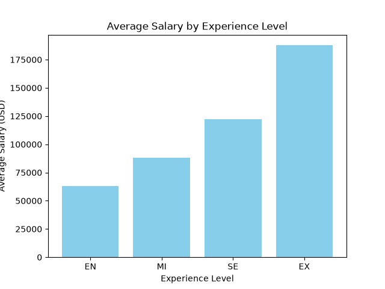
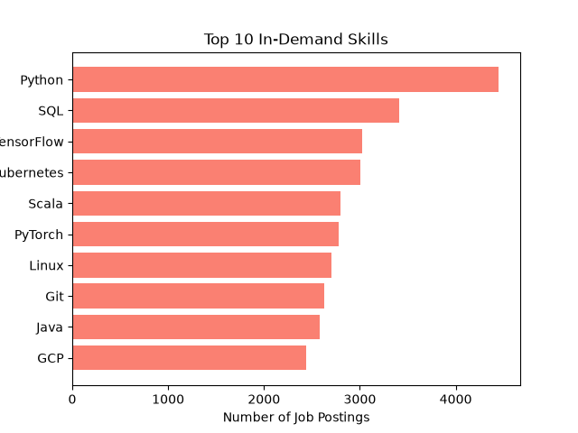

# job-market-analysis
Analyzing salary trends, in-demand skills, and remote work patterns in the AI/ML job market using Python, MySQL, and data visualization.

## Overview
This project explores a dataset of 15,000 AI/ML job postings to uncover patterns in compensation, required skills, and remote work, using a full pipeline from raw CSV to a structured MySQL database to visualized insights.

## Tools Used

- **Python** — data cleaning and pipeline logic (Pandas)
- **MySQL** — relational database to store and query job data
- **mysql-connector-python** — connects Python to MySQL
- **Matplotlib** — data visualization
- **Jupyter Notebook** — development environment

## Dataset
15,000 AI/ML job postings including job title, salary (USD), experience level, company location, required skills, industry, and remote work ratio.

## Database Schema
A single `jobs` table in MySQL:

| Column | Type | Description |
|---|---|---|
| job_id | VARCHAR(10) | Unique job identifier |
| job_title | VARCHAR(100) | Job title |
| salary_usd | FLOAT | Annual salary in USD |
| experience_level | VARCHAR(10) | EN / MI / SE / EX |
| company_location | VARCHAR(100) | Country of the hiring company |
| required_skills | VARCHAR(255) | Comma-separated list of required skills |
| industry | VARCHAR(100) | Industry sector |
| remote_ratio | INT | 0, 50, or 100 (% remote) |

## Process

1. Loaded and cleaned the raw CSV using Pandas (handled missing values, standardized text, validated numeric fields)
2. Designed and created a MySQL table to hold the cleaned data
3. Loaded the cleaned dataset into MySQL via Python (`mysql-connector-python`)
4. Wrote SQL queries using aggregate functions (`AVG`, `GROUP BY`) to extract insights
5. Pulled query results back into Python and visualized them with Matplotlib

## Key Findings

### 1. Salary rises sharply with experience level
| Experience Level | Average Salary (USD) |
|---|---|
| Entry (EN) | $63,133 |
| Mid (MI) | $87,955 |
| Senior (SE) | $122,188 |
| Executive (EX) | $187,724 |

### 2. Python dominates required skills
Top 10 skills across all postings: Python (4,450), SQL (3,407), TensorFlow (3,022), Kubernetes (3,009), Scala (2,794), PyTorch (2,777), Linux (2,705), Git (2,631), Java (2,578), GCP (2,442).

### 3. Remote work ratio has minimal impact on salary
| Remote Ratio | Average Salary (USD) |
|---|---|
| 0% (Onsite) | $114,140 |
| 50% (Hybrid) | $115,777 |
| 100% (Remote) | $116,161 |

Salaries across onsite, hybrid, and fully remote roles differ by less than 2%, suggesting remote work arrangement has little bearing on AI job compensation in this dataset.

## How to Run

1. Clone this repository
2. Install dependencies: `pip install pandas mysql-connector-python matplotlib`
3. Create a MySQL database named `job_market`
4. Open `job_market_analysis.ipynb` in Jupyter and run the cells in order
